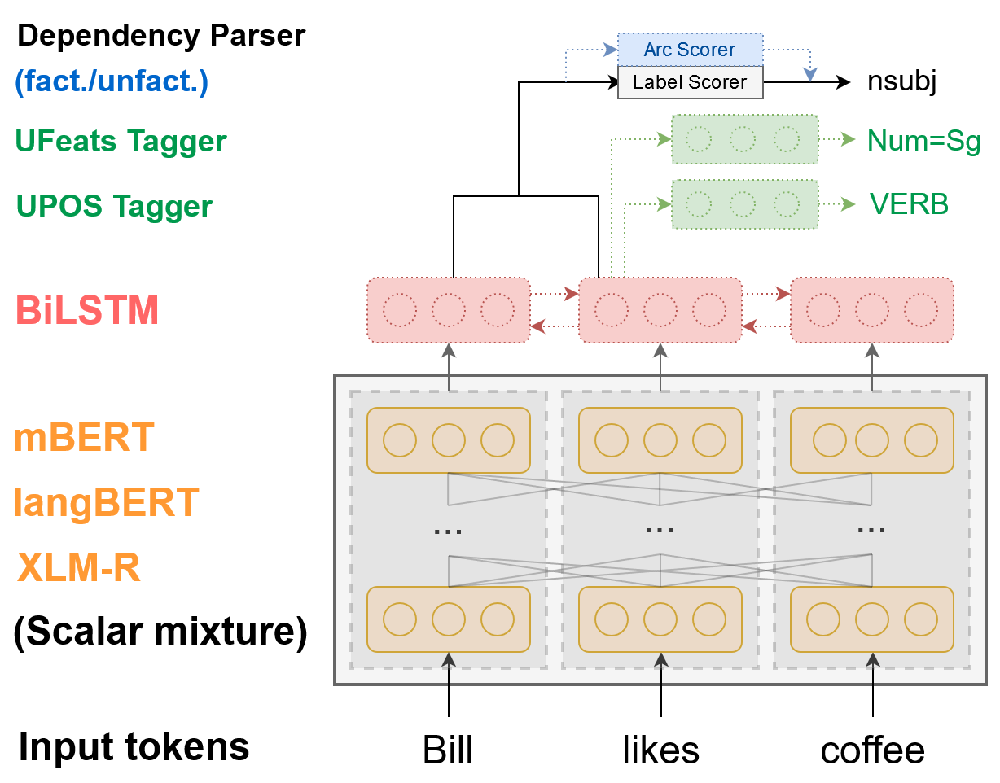

# STEPS Parser

[](LICENSE)

This repository contains the companion code for STEPS, the modular [Universal Dependencies](
https://universaldependencies.org/) parser described in the paper

> [Stefan Grünewald, Annemarie Friedrich, and Jonas Kuhn (2020): **Applying Occam's Razor to Transformer-Based Dependency Parsing: What Works, What Doesn't, and What is Really Necessary.** arXiv:2010.12699](https://arxiv.org/abs/2010.12699)

The code allows users to reproduce and extend the results reported in the study.
Please cite the above paper when using our code, and direct any questions or 
feedback regarding our parser at [Stefan Grünewald](mailto:stefan.gruenewald@de.bosch.com).

### Disclaimer: Purpose of the Project

This software is a research prototype, solely developed for and published as
part of the publication cited above. It will neither be maintained nor monitored in any way.




## Project Structure

The repository has the following directory structure:
```
steps-parser/
    configs/                            Example configuration files for the parser
    data/
        corpora/                        Folder to put training/validation UD corpora
            en_ewt/                     Folder for English-EWT corpus files
            lv_lvtb/                    Folder for Latvian-LVTB corpus files
            download_corpora.sh         Script for downloading example corpus files (English-EWT, Latvian-LVTB)
            delexicalize_corpus.py      Script for replacing lexical material in enhanced dependency labels with placeholders in a UD corpus
        pretrained-embeddings/          Folder for pre-trained word embeddings
            download_embeddings.sh      Script for downloading pre-trained word embeddings
        saved_models/                   Folder for saved models
            download_models.sh          Script for downloading trained parser models (forthcoming)
    src/
        data_handling/                  Code for processing dependency-annotated sentence data
        logger/                         Code for logging (--> boring)
        models/                         Actual model code (parser, classifier)
            embeddings/                 Code for handling contextualized word embeddings
            outputs/                    Code for output modules (arc scorer, label scorer etc.)
            post_processing/            Dependency tree/graph post-processing
            multi_parser.py             The main class for computing outputs from input embeddings
        trainer/                        Training logic, loss scheduling, evaluation
        util/                           Util scripts, e.g. for maximum spanning trees and label lexicalization
        init_config.py                  Initialization of model, trainer, and data loaders
        parse_corpus.py                 Main script for parsing UD corpora using a trained model
        parse_raw.py                    Main script for parsing raw text using a trained model
        train.py                        Main script for training models
    environment.yml                     Conda environment file for STEPS
```


## Using the Parser

### Requirements
STEPS requires the following dependencies:
* [Python](https://www.python.org/) == 3.7.7
* [Huggingface Transformers](https://github.com/huggingface/transformers) == 3.1.0
* [MLFlow](https://mlflow.org/)
* [Stanza](https://stanfordnlp.github.io/stanza/)
* [pyconll](https://github.com/pyconll/pyconll/)

You can install all the above dependencies easily using [Conda](https://docs.conda.io/en/latest/)
and the ```environment.yml``` file provided by us:
```bash
conda env create -f environment.yml
conda activate stepsenv
```

For **post-training evaluation**, you will also need to download the [conll18_ud_eval.py](http://universaldependencies.org/conll18/conll18_ud_eval.py)
and [iwpt20_xud_eval.py](https://universaldependencies.org/iwpt20/iwpt20_xud_eval.py) scripts and replace the respective placeholder
files in `src/util/` with them.
Note that we are **not distributing** these files with our code due to licensing complications.

**Example corpus files** (English-EWT, Latvian-LVTB) and **example transformer language models** (mBERT, XLM-R-large) can be downloaded by running the 
`download_corpora.sh` and `download_embeddings.sh` scripts in the respective folders.

**Note:** Since the model files are quite large, the downloads might take a long time depending on your internet connection. You may want to edit the
download scripts in order to download only the particular models you are actually interested in (see comments in the respective scripts).


### Training Models
To train your own parser model, run `python src/train.py [CONFIG_PATH] -e [EVALUATION_MODE]`.

We have provided two example configuration files to get started:
* **English-EWT, basic dependencies, mBERT:** `python src/train.py configs/en-basic-mbert.json -e basic`
* **Latvian-LVTB, enhanced dependencies, XLM-R:** `python src/train.py configs/lv-enhanced-xlmr.json -e enhanced`

(Note: Training is GPU memory intensive, particularly for the XLM-R-large model. If you run out of memory, try 
reducing the `batch_size` in the configuration files while lowering the learning rate and raising the
number of warmup steps in `lr_lambda` accordingly.)

For these configurations, you will need to download the example corpora and transformer language models (see above).
After training, the respective trained models will be saved to the `saved_models` folder.


### Parsing Corpora Using a Trained Model
To parse a given corpus from a CoNLL-U file, run `python src/parse_corpus.py [MODEL_DIR] [CORPUS_FILENAME] -o [OUTPUT_FILENAME]`.

You can also evaluate against the input corpus directly after parsing. To do so, add the following options:
* `-e basic` for basic dependency parsing (this will use the `conll18_ud_eval.py` script for evaluation)
* `-e enhanced -k 6 7` for enhanced dependency parsing (this will use the `iwpt20_xud_eval.py` script for evaluation and copy over
   the basic layer annotation columns)

To parse raw text (using the Stanza tokenizer for the provided language code), run `python src/parse_raw.py [MODEL_DIR] [LANGUAGE_CODE] [TEXT_CORPUS_FILENAME] -o [OUTPUT_FILENAMEs]`.

Note: Make sure to download the appropriate Stanza model first (e.g. `stanza.download(lang="en", processors="tokenize,mwt")`).

## Downloading Trained Models
Trained models for STEPS will be released on Zenodo in the coming days. Once all models are available, we will also release a script (`download_models.sh`) for bulk download.

The table below lists the already available models as well as the observed parsing accuracies on the respective test sets. Language names link to the downloadable model data. Note that the parsing accuracies given in the table differ slightly from the numbers in our paper because we provide only a single model here (usually the best-performing one) instead of an average, and use gold tokenization to evaluate the enhanced models.

| Language                                     | UD type   | Language model | (E)LAS F1 |
| -------------------------------------------- | --------- | -------------- | --------- |
| [Arabic](https://zenodo.org/record/4682936)  | basic     | mBERT          |     83.98 |
|                                              | basic     | XLM-R          |     86.61 |
|                                              | enhanced  | XLM-R          |     81.90 |
| [Chinese](https://zenodo.org/record/4686799) | basic     | mBERT          |     84.99 |
|                                              | basic     | XLM-R          |     88.02 |
| [Czech](https://zenodo.org/record/4686859)   | basic     | mBERT          |     92.67 |
|                                              | basic     | XLM-R          |     94.60 |
|                                              | enhanced  | XLM-R          |     90.15 |
| [English](https://zenodo.org/record/4614023) | basic     | mBERT          |     89.26 |
|                                              | basic     | XLM-R          |     92.00 |
|                                              | enhanced  | XLM-R          |     90.50 |
| [Finnish](https://zenodo.org/record/4686609) | basic     | mBERT          |     89.09 |
|                                              | basic     | XLM-R          |     94.42 |
|                                              | enhanced  | XLM-R          |     92.79 |
| [German](https://zenodo.org/record/4672061)  | basic     | mBERT          |     84.19 |
|                                              | basic     | XLM-R          |     86.17 |
| [Hindi](https://zenodo.org/record/4683144)   | basic     | mBERT          |     91.45 |
|                                              | basic     | XLM-R          |     93.43 |
| [Italian](https://zenodo.org/record/4686890) | basic     | mBERT          |     93.24 |
|                                              | basic     | XLM-R          |     94.99 |
|                                              | enhanced  | XLM-R          |     92.92 |
| [Japanese](https://zenodo.org/record/4686927)| basic     | mBERT          |     92.27 |
|                                              | basic     | XLM-R          |     94.27 |
| [Latvian](https://zenodo.org/record/4686995) | basic     | mBERT          |     85.29 |
|                                              | basic     | XLM-R          |     92.07 |
|                                              | enhanced  | XLM-R          |     89.60 |
| [Russian](https://zenodo.org/record/4683090) | basic     | mBERT          |     93.78 |
|                                              | basic     | XLM-R          |     95.31 |
|                                              | enhanced  | XLM-R          |     94.60 |

## License
STEPS is open-sourced under the AGPL v3 license. See the [LICENSE](LICENSE) file for details.

For a list of other open source components included in STEPS, see the file [3rd-party-licenses.txt](3rd-party-licenses.txt).

The software, including its dependencies, may be covered by third party rights, including patents.
You should not execute this code unless you have obtained the appropriate rights, which the authors
are not purporting to give.

